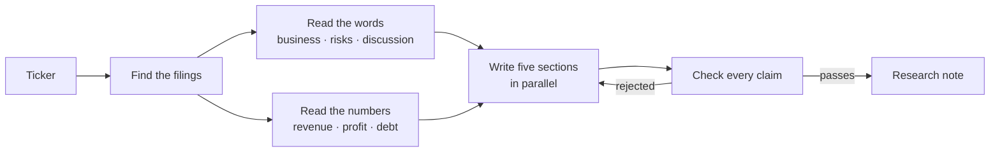
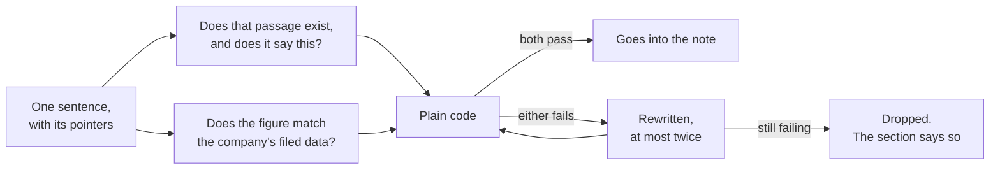

# equity-research-agent

[](https://github.com/berkaykoklu/equity-research-agent/actions/workflows/ci.yml)

Type a ticker; get a research note in which **every sentence is traceable to the
paragraph it came from**, and in which the numbers come from the company's own
filed data rather than from a language model.

The interesting part is not the writing. It is that a piece of ordinary
deterministic code decides whether each sentence is allowed to exist — and that
the same code gates every change to this repository.

## A real claim, from a real run

```
Macroeconomic and international exposure remains a material risk. Apple states
that sales outside the U.S. account for a majority of net sales and that much
of its complex supply chain is overseas. …
[0000320193-25-000079#5; RevenueFromContractWithCustomerExcludingAssessedTax FY2025 = 416,161,000,000]
```

Every part of that citation is checkable. `0000320193-25-000079` is Apple's
FY2025 10-K; `#5` is a specific indexed passage of it; and the figure is
rendered beside the exact XBRL tag and period it was read from, so a reader can
look it up in the company's own filed data rather than take it on trust. The
model never typed that number. The full note is in
[`evals/fixtures/note_aapl.md`](evals/fixtures/note_aapl.md).

**Measured, not estimated.** That note reports `Run cost $0.0922 · 81.4s` for
five sections; other runs came in at `$0.0974` and `$0.1024`. The figures are read
from the provider's own token counts at each model's own rates, not copied from
a pricing page — an earlier estimate of $0.13 was a third too high, which is the
whole argument for measuring.

## Quickstart

```bash
uv sync
cp .env.example .env      # SEC requires a real contact address in EDGAR_USER_AGENT
uv run era ingest AAPL    # fetch, cut into chapters, embed, store
uv run era research AAPL  # write the note
```

## How it works

Six things happen. The middle step splits in two because words and numbers need
completely different handling.



### Words and numbers travel separately

Most systems of this shape convert everything — paragraphs, tables, figures —
into one searchable pool, then ask a model to pull answers out of it. That is
how you get a model confidently reporting revenue that appears in no filing.

Here, **the model is never able to type a figure.** It names a metric it wants
("revenue"); code looks that name up in the company's XBRL data and attaches the
real tag, period, value and accession. A model that cannot write a number
cannot misquote one.

### Cutting a filing into chapters is the hard part

A 10-K runs 60 to 400 pages. JPMorgan's is 380 — twice the length of a novel.
Finding where "Item 1A. Risk Factors" actually begins sounds structural and is
not: every filer formats differently, the table of contents lists the same
headings, cross-references mention them mid-sentence, and Microsoft repeats
`Item 1` as a running page header on **every printed page**.

A pure regex parser scored 14 of 20 on real filings — and its failures were
silent, returning a table-of-contents line as though it were a chapter.

So boundary selection is a judgment call, and judgment is what models are for:

- **Code** finds every candidate heading.
- **A model** picks which candidates are real — it sees only the candidate lines
  and a little context, never document content, and returns **integers only**.
- **Code** slices the raw text at those offsets, so nothing can be paraphrased
  or quietly dropped.
- **Code** verifies each chapter opens with its own title; a failure means the
  chapter is reported missing, never guessed.
- The decision is **cached per filing**, which restores determinism.

Measured against real filings: 20 tickers attempted, 19 resolved to a fetchable
10-K (XOM now points at a holding company that has never filed one), and of
those 19, **15 yielded all three chapters with zero wrong content**. The other
four are reported missing, which is the correct answer for them. See
[`docs/parser-validation.md`](docs/parser-validation.md).

### The checker



No model judges another model here. Because claims carry their sources as typed
fields rather than as footnotes buried in prose, checking is a database lookup,
a subtraction and a set difference. It is free, identical on every run, and
cannot be argued with.

**The same function runs twice**: inside the graph, rejecting sentences as they
are written; and as the CI gate every change must pass
([`evals/tier1/`](evals/tier1/)). The standard that stops a bad sentence
reaching a reader is the standard that stops a bad change reaching `main`.

### What happens when something is missing

The design bias throughout is that **a visible gap beats a confident guess.**

- A chapter whose heading cannot be found is reported unavailable, with the
  reason, and the note says so. GE and Intel label their items only in a
  back-of-document index; JPMorgan and Chevron put the real discussion
  elsewhere entirely. All four are reported missing rather than invented.
- A metric absent from XBRL appears under "metrics that could not be resolved".
- A ticker resolving to a holding company with no annual report says exactly
  that, naming the entity — `XOM` currently does.
- A claim whose citation does not resolve is rejected and regenerated, at most
  twice. Unbounded retry loops are how agents quietly spend a lot of money.
- **A claim still failing after those retries is dropped, not published.** If a
  section has nothing left, it is marked unavailable and says why. The final
  review of this repo found the opposite behaviour — exhausting the retry budget
  shipped the rejected text, under the not-investment-advice footer — which is
  the single worst failure this design can have, so it now has a test that
  reproduces the exact sentence and asserts it never reaches the reader.

## Measured quality

Two tiers of test, and **only one of them gates a merge**.

**Tier 1** ([`evals/tier1/`](evals/tier1/)) runs the runtime verifier over a note
captured from a real run. Deterministic, offline, free — so it blocks every
change. Proven to bite: an unresolvable citation, advisory language, and an
invented figure each fail it.

**Tier 2** ([`evals/tier2/`](evals/tier2/)) asks a model whether the notes are
any *good*, across Apple, Coca-Cola and Johnson & Johnson. It **never** gates a
merge — a check that fails randomly is one people learn to ignore.

| | hallucination ↓ | answer relevance ↑ |
|---|---|---|
| judge sees only filing passages | 0.31 | 0.91 |
| judge sees the sources claims actually cite | **0.11** | **0.93** |

Both rows are real runs, and the second is the honest one — but the first is
kept because the difference is the interesting part.

Claims cite two kinds of source: passages from the filing, and exact figures
from its XBRL data. The first run handed the judge only the passages, so every
correctly-sourced numeric claim looked unsupported and the score measured a gap
in the *evidence given to the judge* rather than a gap in the notes.

Changing an eval after disliking its result is how dishonest benchmarks get
made. What makes this defensible is that the fix is independently correct — a
judge scoring grounding must see every source a claim cites — and it would have
been the right change had the first number come back at 0.05.

`ContextPrecision` was dropped rather than reported. It requires an
`expected_output`, and there is no single correct research note to compare a
research note against; writing reference notes by hand so a metric has
something to grade would be inventing a ground truth to score ourselves
against.

## Design decisions worth defending

1. **The verifier is code, not a model judging a model.** Citation resolution
   and numeric fidelity are decidable. Using a model would trade a guarantee for
   a probability.
2. **Numbers never pass through the model.** Structurally eliminates the most
   common failure in financial RAG.
3. **Each section retrieves its own sources.** Feeding one section 25k tokens of
   mostly-irrelevant context invites drift toward material it should not cite.
   It is also cheaper, and cost analysis is what surfaced the design flaw.
4. **Assembly is deterministic.** A generative assembler could introduce a
   sentence the verifier never saw.
5. **Two tiers of test, and only one gates.** Deterministic checks block merges;
   judged quality is tracked but never blocking. A gate that fails randomly is
   one people learn to ignore.
6. **The no-advice rule is a failing test, not a disclaimer.** Its own footer had
   to be reworded, because "not a recommendation to buy or sell" tripped it.

## Limits

- **US issuers only** — this reads SEC EDGAR.
- **Roughly 20–30 companies indexed at once**, bounded by the free Postgres tier.
- **Chapter detection is heuristic.** Measured at zero wrong chapters across 20
  filings, which is not the same as a guarantee.
- **The checker proves a citation resolves, not that a sentence is true.** A
  passage mentioning "4,200 pending lawsuits" satisfies a claim about "4,200
  stores closed" — the number matches. Judged evals cover what code cannot.
- **Figures spelled in words** ("three billion") are not currently checked.

## Development

```bash
uv run pytest          # 279 tests, offline, no API keys required
uv run ruff check .
uv run mypy src
```

The suite never touches the network or spends anything: every external
surface — SEC, embeddings, the vector store, the model — sits behind a Protocol
with a fake.

## Licence

MIT.
